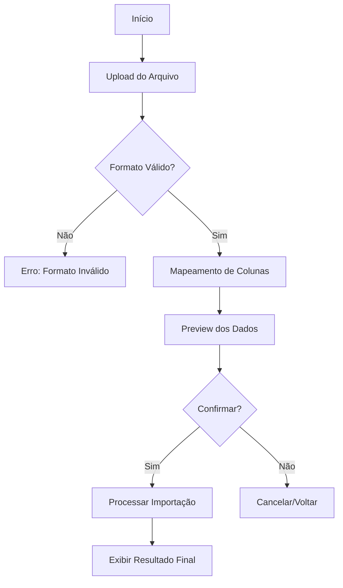

# SPEC-009: Importação de Dados via Planilha (CSV/XLSX)

## 1. Resumo Executivo
Esta funcionalidade permite que o usuário importe em massa lançamentos financeiros através de arquivos de planilha (CSV ou XLSX), facilitando a migração de dados de outros sistemas ou faturas bancárias para a aplicação.

## 2. Requisitos de Negócio
- **Público-alvo:** Usuários que possuem grande volume de dados externos.
- **Objetivo:** Reduzir o esforço manual de cadastro individual de lançamentos.
- **Impacto:** Alta melhoria na experiência de onboarding do usuário.

## 3. Requisitos Funcionais (RF)
- **RF001:** O sistema deve permitir o upload de arquivos nos formatos `.csv`, `.xls` e `.xlsx`.
- **RF002:** O sistema deve fornecer um modelo (template) para download, garantindo que o usuário saiba quais colunas são necessárias.
- **RF003:** O sistema deve validar os campos obrigatórios: Data, Descrição, Valor, Tipo (Receita/Despesa) e Categoria.
- **RF004:** O sistema deve permitir o mapeamento manual de colunas caso o cabeçalho do arquivo do usuário não coincida com o esperado.
- **RF005:** O sistema deve exibir um resumo prévio (preview) dos dados antes da confirmação final do processamento.
- **RF006:** O sistema deve lidar com erros de validação linha a linha, informando claramente qual linha falhou e o motivo.

## 4. Requisitos Não Funcionais (RNF)
- **RNF001:** O processamento de arquivos grandes (> 500 linhas) deve ser realizado de forma assíncrona (Celery).
- **RNF002:** Segurança: Validar o tipo de arquivo (MIME type) para evitar execução de scripts maliciosos.
- **RNF003:** Limite de tamanho: Máximo de 5MB por arquivo.

## 5. Fluxo da Interface (UX)
1. **Navegação:** Usuário acessa "Lançamentos" > Botão "Importar Planilha".
2. **Seleção:** Modal ou tela de upload para arrastar o arquivo.
3. **Mapeamento:** Caso as colunas não sejam reconhecidas automaticamente, o usuário seleciona qual coluna da planilha corresponde a qual campo do sistema.
4. **Resumo/Preview:** Tabela com os primeiros 5 itens e totalizadores para revisão.
5. **Processamento:** Feedback visual de progresso (spinner ou barra de carregamento).
6. **Conclusão:** Mensagem de sucesso detalhando quantos itens foram importados com êxito.

## 6. Diagrama de Fluxo (Mermaid)

## 7. Modelagem de Dados e API
- **Endpoint:** `POST /api/transactions/import/`
- **Payload:** Multipart Form Data (arquivo + metadados de mapeamento).
- **Resposta:** JSON com `task_id` (se assíncrono) ou resumo imediato.

## 8. Critérios de Aceite
- O usuário consegue baixar o template `.csv`.
- O sistema importa 100 linhas em menos de 10 segundos.
- Se a categoria não existir, o sistema deve sugerir a criação ou retornar erro específico.
- Registros duplicados (mesmo dia, valor e descrição) devem ser sinalizados como alertas.
