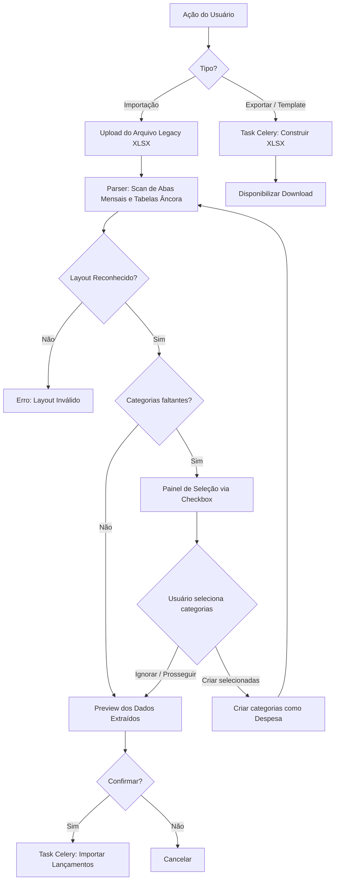

# SPEC-008: Importação e Exportação de Planilha (Formato Legado XLSX)

## 1. Resumo Executivo
Esta funcionalidade permite que o usuário importe, exporte e baixe templates de lançamentos financeiros seguindo o formato legado específico de planilha (.xlsx), que possui os dados fracionados em abas mensais e tabelas dinâmicas por categoria, facilitando a migração e backup no formato já familiar ao usuário.

## 2. Requisitos de Negócio
- **Público-alvo:** Usuários realizando migração do controle financeiro em planilhas retrocompatíveis.
- **Objetivo:** Permitir o preenchimento offline, a migração inicial de todo o histórico financeiro e o backup contínuo respeitando o template adotado no passado.
- **Impacto:** Redução crítica de perda de dados e fluidez na curva de adoção do novo sistema web.

## 3. Requisitos Funcionais (RF)
- **RF001:** O sistema deve suportar parsing específico para arquivos `.xlsx` tolerando arquivos com abas mensais (Janeiro a Dezembro) parciais ou arquivos completos com todas as 12 abas mensais (além de ignorar abas de totalizadores como "Gastos e acompanhamentos").
- **RF002:** Durante a leitura, o sistema deve iterar pelas abas (linhas de 3 a 160) localizando tabelas por meio das âncoras na mesma linha: ("Observação", "dia", "R$") e inferir a **Categoria** do lançamento procurando pelas 2 linhas logo acima desse cabeçalho.
- **RF003:** O sistema deve combinar o nome da aba (que representa o Mês), e a coluna "dia" da tabela encontrada para compor a **Data** real da transação. O sistema deve deduzir o Ano (através do nome do arquivo ou solicitar como parâmetro na API/Interface).
- **RF004:** As despesas listadas abaixo da âncora deverão ser criadas como lançamentos, respeitando a categoria inferida acima, consumindo as colunas "Observação" (descrição), "dia" e "R$" (valor), cessando a leitura daquela sub-tabela quando encontrar uma linha em branco.
- **RF005:** O sistema deve possuir um endpoint de geração do modelo (template) vazio que reproduza essa mesma topologia de 12 abas mensais e tabelas por categorias ativas no banco.
- **RF006:** O sistema deve permitir exportar (download) todos os lançamentos do banco compondo um novo `.xlsx` com todas as 12 abas geradas e o rateio de categorias idêntico.
- **RF007:** O sistema **só deve salvar as transações no banco de dados após a confirmação explícita do usuário**.
- **RF008:** A interface deve exibir na íntegra **todos os lançamentos extraídos** em formato de pré-visualização (preview) detalhada, para que o usuário possa verificar se todas as informações foram coletadas corretamente antes da persistência.
- **RF009:** Durante a pré-visualização, o sistema deve alertar o usuário exibindo de forma destacada quaisquer informações inválidas ou inconsistências encontradas, incluindo:
  - Data incompatível (ex: linha com mês diferente do mês correspondente à aba de onde o dado foi extraído);
  - Valores negativos ou não-numéricos na coluna R$;
  - Ausência de descrição/observação nas linhas mapeadas;
  - Categorias referenciadas na planilha que **não existem** no banco de dados do usuário.
- **RF010:** Ao término da análise do arquivo, caso uma ou mais categorias da planilha não existam no sistema, a interface deve exibir um bloco de alerta destacado **antes** da tabela de pré-visualização, listando cada categoria faltante com um **checkbox individual** de seleção. Os lançamentos vinculados a essas categorias faltantes devem ser sinalizados na tabela com status de aviso (warning), impedindo que sejam confirmados até que a categoria seja criada e a planilha reanalisada, **ou** permitindo que o usuário opte por ignorá-los e confirmar apenas os lançamentos com categorias válidas.
- **RF011:** O painel de categorias faltantes deve oferecer:
  - Um **checkbox por categoria** (todos marcados por padrão) permitindo que o usuário escolha individualmente quais quer criar;
  - Um controle de **"Selecionar todas" / "Desmarcar todas"** para ação em lote;
  - Um botão **"Criar categorias selecionadas"** que cria apenas as categorias marcadas como tipo *Despesa* e, ao término, reanalisada automaticamente a planilha sem nova intervenção do usuário;
  - Categorias desmarcadas permanecem faltantes: seus lançamentos continuam com badge de aviso e são excluídos do lote de confirmação;
  - Um link secundário **"Gerenciar categorias"** (`/categorias`) para o usuário que preferir configurar tipo e demais atributos antes de criar.

## 4. Requisitos Não Funcionais (RNF)
- **RNF001:** O processamento de arquivos grandes (> 500 linhas) deve ser realizado de forma assíncrona (Celery).
- **RNF002:** Segurança: Validar o tipo de arquivo (MIME type) para evitar execução de scripts maliciosos.
- **RNF003:** Limite de tamanho: Máximo de 5MB por arquivo.

## 5. Fluxo da Interface (UX)
1. **Navegação:** Usuário acessa "Lançamentos" > Botão "Importar Planilha".
2. **Seleção:** Modal ou tela de upload para fazer o upload do arquivo `.xlsx`.
3. **Extração:** Ao carregar o arquivo, o backend realiza o scan em memória, **sem salvar no banco**.
4. **Visualização Total:** A interface exibe a tabela completa com **todos** os lançamentos interceptados nas várias abas.
5. **Sinalização de Inconsistências:** Erros são pintados junto à linha na tabela (ex: coluna dia com data incongruente em relação à aba, ou valores negativos) proibindo ou alertando salvamento em lote.
5a. **Categorias Faltantes — Painel de Seleção via Checkbox:** Se ao término da análise existirem categorias da planilha não cadastradas no sistema, a interface exibe um **bloco de alerta destacado** (acima da tabela de preview) com:
    - Um **checkbox por categoria faltante** (todos marcados por padrão), permitindo seleção individual;
    - Um controle de **"Selecionar todas" / "Desmarcar todas"** para ação em lote;
    - Contador dinâmico exibindo quantas categorias estão selecionadas (ex: *"3 de 5 selecionadas"*);
    - Botão principal **"Criar categorias selecionadas"**: cria as marcadas como tipo *Despesa* e reanalisada automaticamente o arquivo ao final;
    - Link secundário **"Gerenciar categorias"** → `/categorias` para quem preferir definir tipo antes de criar;
    - Instrução contextual: *"Selecione as categorias que deseja criar e clique em Criar, ou prossiga confirmando apenas os lançamentos com categorias já válidas."*
    - Os lançamentos afetados pelas categorias faltantes (independente de seleção) aparecem marcados com badge `Categoria inválida` na coluna de status.
6. **Confirmação Expressa:** O usuário confere visualmente e deve ativar deliberadamente o botão "Confirmar e Salvar X Lançamentos" para gravar oficialmente no banco de dados. Lançamentos com categoria faltante são **excluídos automaticamente** do lote de confirmação, salvo decisão explícita do usuário.
7. **Conclusão:** Mensagem de sucesso detalhando os itens salvos e, se houver, quantos foram ignorados por categoria faltante.

## 6. Diagrama de Fluxo (Mermaid)

## 7. Modelagem de Dados e API
- **Endpoint Importação:** `POST /api/transactions/import/`
  - **Payload:** Multipart Form Data (arquivo `.xlsx`).
  - **Resposta:** JSON com Preview dos dados extraídos ou submissão via `task_id`.
- **Endpoint Exportação:** `GET /api/transactions/export/`
  - **Payload:** Query params de filtros/ano.
  - **Resposta:** `task_id` gerado ou Binário `.xlsx` compilado com as abas por mês.
- **Endpoint Template:** `GET /api/transactions/template/`
  - **Resposta:** O download direto do XLSX pré-formatado apenas com cabeçalhos padrão.

## 8. Critérios de Aceite
- O usuário consegue baixar o template `.xlsx` formatado e vazio através do sistema.
- A aplicação apresenta uma visualização prévia completa (preview) listando absolutamente todas as linhas lidas para que o usuário verifique.
- Lançamentos constando datas inconsistentes com a aba (ex: dia 32 ou aba "Janeiro" e data inserida de fevereiro) ou valores negativos exibem erros críticos na pré-visualização, alertando o usuário.
- Nenhuma modificação é feita no banco de dados até que a ação seja aprovada pelo clique de "Confirmar".
- Se uma ou mais categorias referenciadas na planilha não existirem no banco, o sistema exibe um bloco de alerta destacado **acima** da tabela de preview, listando as categorias faltantes e fornecendo link direto para `/categorias`.
- Os lançamentos com categoria faltante recebem badge de aviso na tabela de preview e são excluídos do lote de confirmação por padrão.
- O usuário pode optar por prosseguir confirmando apenas os lançamentos com categorias válidas, ou cancelar, criar as categorias e reanalisar o arquivo.
- O painel de categorias faltantes exibe um checkbox por categoria, todos marcados por padrão, com controle de "Selecionar todas / Desmarcar todas" e contador dinâmico (ex: "3 de 5 selecionadas").
- Ao clicar em "Criar categorias selecionadas", apenas as categorias marcadas são criadas como tipo *Despesa* e a planilha é reanalisada automaticamente, sem exigir nova interação do usuário.
- Categorias desmarcadas pelo usuário permanecem faltantes: seus lançamentos conservam o badge `Categoria inválida` e são excluídos do lote de confirmação.
- Registros duplicados (mesmo dia, valor e descrição) detectados devem ser sinalizados como alertas antes da confirmação.
